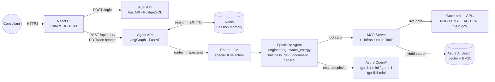
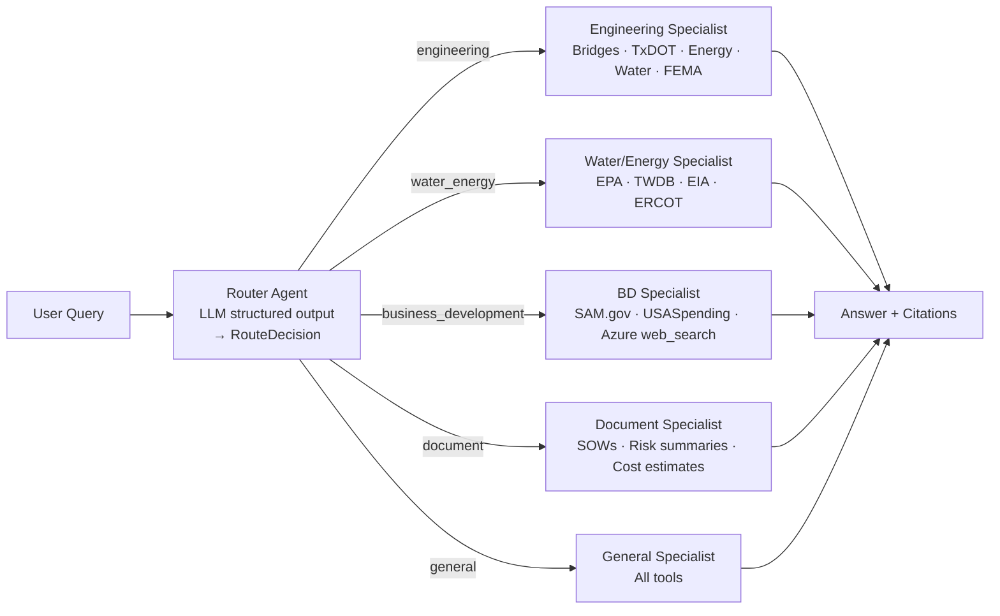
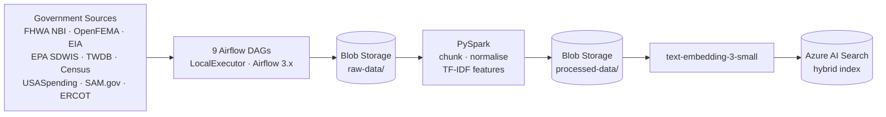
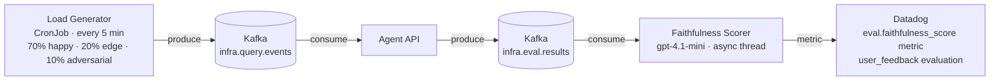
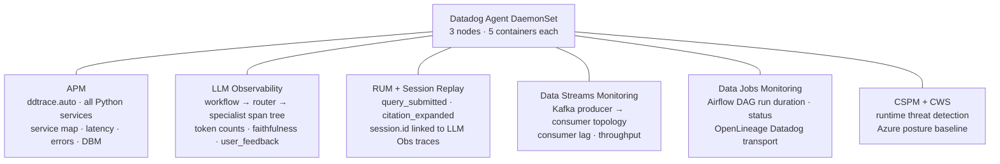

# InfraAdvisor AI

> AI-powered infrastructure advisory platform for Architecture, Engineering, Construction, Operations, and Management (AECOM) consulting — answers questions about bridges, disasters, energy grids, water systems, and federal procurement using live US government data.

Built as a **reference architecture** for building, training, deploying, and monitoring an AI agent end-to-end on Azure + Kubernetes.


---

## Overview


| Phase | What happens |
|---|---|
| **① Ingest & Train** | 9 Airflow DAGs pull raw data from government APIs → Spark normalises and chunks it → Azure Blob Storage |
| **② Knowledge Base** | AI Search indexes chunks embedded with `text-embedding-3-small` — hybrid vector + BM25 keyword |
| **③ AI Agent** | Consultant query → router LLM selects specialist → specialist agent calls MCP tools → `gpt-4.1-mini` synthesises answer |
| **④ Consultant UI** | React + Chakra UI chat with auth, domain tiles, citation sidebar, sandbox playground, admin panel |
| **⑤ Observe** | Datadog covers APM, LLM Observability, RUM, Data Streams, Data Jobs, CSPM across all layers |

---

## Architecture

### Inference Path



**MCP tools (11):** `get_bridge_condition` · `get_disaster_history` · `get_energy_infrastructure` · `get_water_infrastructure` · `get_ercot_energy_storage` · `search_txdot_open_data` · `search_project_knowledge` · `draft_document` · `get_procurement_opportunities` · `get_contract_awards` · `search_web_procurement`

---

### Multi-Agent Routing

Every query passes through a two-stage pipeline before any tool is called.



Each specialist receives only its domain-relevant tools — the engineering specialist cannot call procurement tools, and vice versa.

---

### Training Pipeline



Spark runs in local mode inside the Airflow scheduler pod — no separate cluster needed at demo scale.

---

### Evaluation Pipeline



Scoring runs as a fire-and-forget background thread — zero added latency for real users. User thumbs-up/down feedback also flows to Datadog LLM Observability as `user_feedback` evaluations.

---

### Observability



Managed by a single `DatadogAgent` custom resource via the Datadog Operator.

---

## Services

| Service | Language | Description |
|---|---|---|
| [`services/agent-api`](services/agent-api/) | Python 3.12 | FastAPI + LangGraph agent, Redis session memory, multi-agent routing, Kafka eval producer |
| [`services/mcp-server`](services/mcp-server/) | Python 3.12 | FastMCP server — 11 infrastructure tools across 5 domains |
| [`services/auth-api`](services/auth-api/) | Python 3.12 | FastAPI + PostgreSQL — register, login, password reset (SMTP), admin user management |
| [`services/ui`](services/ui/) | TypeScript / React 18 / Chakra UI v3 | Consultant chat UI — auth, domain tiles, citations, model picker, sandbox, admin panel, guided tour |
| [`services/load-generator`](services/load-generator/) | Python 3.12 | Kafka producer — synthetic query corpus (70 % happy path, 20 % edge, 10 % adversarial) |
| [`services/ingestion`](services/ingestion/) | Python 3.12 | 9 Airflow DAGs — government data ingestion + Spark feature engineering |

## Infrastructure

| Component | Technology | Namespace |
|---|---|---|
| Container platform | AKS — 3× Standard_D2s_v3 | — |
| AI inference | Azure OpenAI — `gpt-4.1-mini`, `gpt-4.1`, `gpt-5.4-mini` | — |
| Embeddings | Azure OpenAI — `text-embedding-3-small` | — |
| Knowledge base | Azure AI Search Standard — hybrid + semantic ranker | — |
| Blob storage | Azure Blob Storage — `raw-data/`, `processed-data/`, `knowledge-docs/` | — |
| User database | PostgreSQL (K8s Deployment) | `infra-advisor` |
| Session memory | Redis (K8s Deployment) | `infra-advisor` |
| Message bus | Kafka via Strimzi Operator | `kafka` |
| Ingestion orchestration | Apache Airflow 3.x (LocalExecutor) | `airflow` |
| Feature engineering | PySpark local mode (inside Airflow scheduler) | `airflow` |
| Dev email capture | MailHog — SMTP + Web UI | `infra-advisor` |
| Observability | Datadog Operator — Agent DaemonSet + Cluster Agent | `datadog` |
| IaC | Azure Bicep — subscription-scoped | — |

---

## Prerequisites

- **Azure** subscription with Contributor access
- **Azure CLI** (`az`), **kubectl**, **kubelogin**, **Helm 3**
- **Python 3.12** + [uv](https://docs.astral.sh/uv/)
- **Node.js 20+** and **npm** (for UI)
- **Docker** (or Podman) for local builds
- **Datadog account** (US3 site) with API + App keys
- **EIA API key** — free at [eia.gov](https://www.eia.gov/opendata/)
- **SAM.gov API key** — free at [api.sam.gov](https://api.sam.gov) (enables procurement opportunities tool)

The web RFP search tool runs on Azure OpenAI's `web_search_preview` tool — no separate vendor key required; it uses the same `AZURE_OPENAI_API_KEY` listed below.

## Quick Start

### 1. Configure environment

```bash
cp .env.example .env
# Fill in all values — see .env.example for required keys
```

### 2. Deploy Azure infrastructure

```bash
make deploy-infra        # AKS, Azure OpenAI, AI Search, Blob Storage via Bicep
make get-credentials     # fetches kubeconfig
kubelogin convert-kubeconfig -l azurecli
```

### 3. Create Kubernetes secrets

```bash
make create-ghcr-secret          # GHCR imagePullSecret
make create-secrets              # all application secrets (reads from .env)
```

`make create-secrets` runs all individual secret targets: MCP server (Azure + EIA + ERCOT + SAM.gov), agent API (Azure OpenAI), auth API (JWT + Postgres), Datadog Postgres (DBM), and airflow secrets.

### 4. Deploy to Kubernetes

```bash
make deploy-k8s   # applies all K8s manifests (runs check-env first)
make run-dags     # triggers all Airflow DAGs
```

### 5. Access the UI

App is served at `https://infra-advisor-ai.kyletaylor.dev` via Cloudflare → AKS LoadBalancer.

```bash
# Local port-forward
kubectl port-forward -n infra-advisor svc/ui 3000:80
```

Default admin credentials are set in `k8s/airflow/values.yaml` (`createUserJob`). For the InfraAdvisor app itself, register via the UI login page (restricted to `@datadoghq.com` domain by default).

### When to re-run each command

| You changed… | Run |
|---|---|
| `infra/bicep/` — AKS config, OpenAI models, AI Search tier, storage | `make deploy-infra` then `make get-credentials` |
| `k8s/` manifests, ConfigMaps, or `.env` secrets | `make deploy-k8s` |
| Application code only (no infra/manifest changes) | Push to `main` — CI builds and `kubectl rollout restart` runs automatically |
| Both Bicep and K8s manifests | `make deploy-infra` → `make get-credentials` → `make deploy-k8s` (always in this order) |

**`make deploy-infra`** provisions or updates Azure cloud resources (AKS cluster, OpenAI deployments, AI Search index, Blob Storage). It is slow (~10–15 min), subscription-scoped, and only needed when cloud infrastructure changes. Re-running it is safe — Bicep deployments are idempotent.

**`make deploy-k8s`** applies Kubernetes manifests and secrets to the running cluster — it does not touch Azure resources. It runs `check-env` first to catch missing `.env` variables before anything is applied.

---

## Local Development

```bash
# Start local Redis + Kafka
docker compose up -d

# Run services (in separate terminals)
set -a && source .env && source .env.local && set +a
cd services/mcp-server && uv run uvicorn src.main:app --reload --port 8000
cd services/agent-api  && uv run uvicorn src.main:app --reload --port 8001
cd services/auth-api   && uv run uvicorn src.main:app --reload --port 8002
cd services/ui         && npm install && npm run dev   # http://localhost:3000

# Run tests
uv run pytest -x services/mcp-server/tests/
uv run pytest -x services/agent-api/tests/
uv run pytest -x services/auth-api/tests/
```

## CI/CD

| Workflow | Trigger | Description |
|---|---|---|
| [CI](.github/workflows/ci.yml) | push / PR | pytest for all Python services |
| [Build & Push](.github/workflows/build-push.yml) | push to `main` | Docker build → GHCR → `kubectl rollout restart` on AKS + Helm upgrade Airflow + DAG sync |

Images: `ghcr.io/kyletaylored/infra-advisor-ai/{service}:latest`

---

## Key Design Decisions

| Decision | Rationale |
|---|---|
| Multi-agent routing | Router LLM classifies domain and selects one of 5 specialists; each specialist gets only its relevant tools — reduces hallucination surface and produces richer Datadog LLM Obs trace trees |
| MCP for tool abstraction | Agent never calls government APIs directly — all data access through versioned MCP tools; MCP server is independently deployable and testable |
| No LLM in MCP server | `draft_document` uses Jinja2 only; LLM reasoning stays in the agent layer for clear observability boundaries |
| Spark in local mode | PySpark runs inside the Airflow scheduler pod — no separate cluster at demo scale; straightforward upgrade path to Spark on K8s |
| Azure Blob as staging | Raw → processed handoff between DAGs and AI Search indexer; Datadog Blob Storage dashboard tracks upload throughput and latency by DAG |
| Kafka for eval | Load generator → `infra.query.events` → agent → `infra.eval.results`; DSM shows the full producer-consumer topology and consumer lag |
| Async faithfulness scoring | `gpt-4.1-mini` scores every response in a background thread — zero latency added for users; results flow to Datadog as `eval.faithfulness_score` metric |
| RUM ↔ LLM Obs linking | Browser RUM session ID is forwarded as `X-DD-RUM-Session-ID` header and set as `session.id` on all LLM Obs spans — enables "View session replay" from any trace |
| Redis suggestion pool | 80-item pool of AECOM-focused suggestions pre-generated by background task; page loads pick 4 at random in ~1 ms with no LLM wait |
| Datadog Operator | Single `DatadogAgent` CR manages DaemonSet, Cluster Agent, RBAC, SSI, and all feature toggles — no raw DaemonSet YAML |

## Datadog Coverage

| Signal | What's instrumented |
|---|---|
| **APM** | All 4 Python services via `ddtrace.auto`; service map; DBM (auth-api → Postgres with `DD_DBM_PROPAGATION_MODE=full`) |
| **LLM Observability** | Full span tree per query: `workflow → router → specialist → tool calls`; token counts; `faithfulness_score` and `user_feedback` evaluations |
| **RUM** | React UI — `query_submitted`, `citation_expanded`, `suggestion_clicked` custom events; session replay; linked to LLM Obs via `session.id` |
| **Data Streams** | Kafka topology: load-generator → `infra.query.events` → agent-api → `infra.eval.results`; consumer lag alerts |
| **Data Jobs** | Airflow DAG run duration, task status, and per-task breakdown via OpenLineage Datadog transport |
| **Dashboards** | infra-overview · llm-observability · mcp-server · pipeline-health · blob-storage (5 total in `datadog/dashboards/`) |
| **Monitors** | faithfulness-score · kafka-consumer-lag · mcp-external-api-error (3 total in `datadog/monitors/`) |
| **Synthetics** | `consultant-query-flow` — end-to-end browser test of the full query flow |

## Documentation

- [Project Map](docs/agent-guides/project-map.md) — services, namespaces, APIs
- [Build, Test & Verify](docs/agent-guides/build-test-verify.md) — per-phase commands
- [Core Conventions](docs/agent-guides/core-conventions.md) — coding standards

## License

MIT
