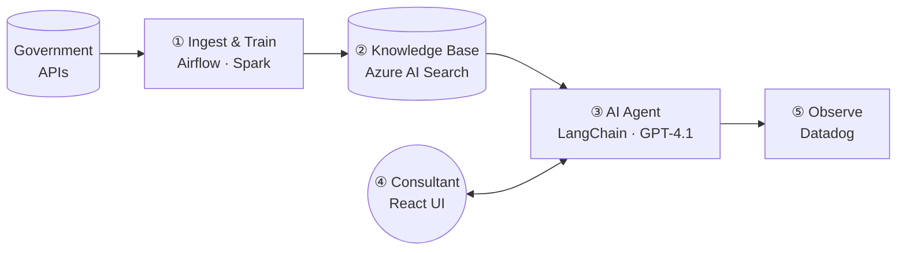
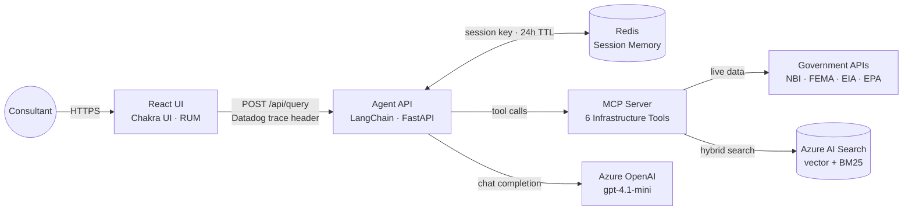
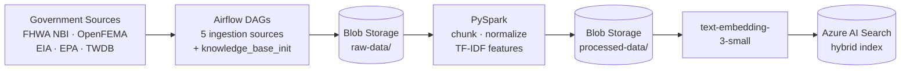
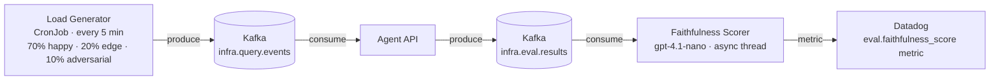
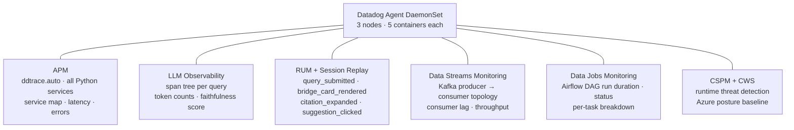

# InfraAdvisor AI

> AI-powered infrastructure advisory for consulting firms — answers questions about bridges, disasters, energy grids, and water systems using live US government data.

Built as a **reference architecture** for building, training, deploying, and monitoring an AI agent end-to-end on Azure + Kubernetes.


---

## Overview



| Phase | What happens |
|---|---|
| **① Ingest & Train** | Airflow DAGs pull raw data from 5 government APIs → Spark normalizes and chunks it → Azure Blob Storage |
| **② Knowledge Base** | AI Search indexer embeds chunks with `text-embedding-3-small` → hybrid vector + keyword index |
| **③ AI Agent** | Consultant query → LangChain agent → MCP tools retrieve context → `gpt-4.1-mini` synthesises answer |
| **④ Consultant UI** | React + Chakra UI chat interface with bridge cards, citation panel, Datadog RUM |
| **⑤ Observe** | Datadog covers APM, LLM Observability, RUM, Data Streams, Data Jobs, CSPM across all layers |

---

## Architecture

### Inference Path

How a consultant question becomes an answer.



**MCP tools:** `get_bridge_condition` · `get_disaster_history` · `get_energy_infrastructure` · `get_water_infrastructure` · `search_project_knowledge` · `draft_document`

---

### Training Pipeline

How raw government data becomes searchable knowledge.



DAGs run in Apache Airflow 3.x with `LocalExecutor`. Spark runs in PySpark local mode inside the Airflow scheduler pod — no separate cluster needed at demo scale.

---

### Evaluation Pipeline

How every response gets scored for quality without adding user-facing latency.



Scoring runs as a fire-and-forget background thread — zero added latency for real users. Datadog DSM shows the full Kafka topology and consumer lag.

---

### Observability

All signal types flow to Datadog from every layer of the stack.



Managed by a single `DatadogAgent` custom resource via the Datadog Operator — no raw DaemonSet YAML.

---

## Services

| Service | Language | Description |
|---|---|---|
| [`services/mcp-server`](services/mcp-server/) | Python 3.12 | FastMCP server — 6 infrastructure tools |
| [`services/agent-api`](services/agent-api/) | Python 3.12 | FastAPI + LangChain agent, Redis session memory, Kafka eval producer |
| [`services/load-generator`](services/load-generator/) | Python 3.12 | Kafka producer — synthetic query corpus (3 tiers) |
| [`services/ui`](services/ui/) | TypeScript / React 18 / Chakra UI v3 | Chat UI with bridge cards, citation panel, Datadog RUM |
| [`services/ingestion`](services/ingestion/) | Python 3.12 | Airflow DAGs — 5 data sources + Spark feature engineering |

## Infrastructure

| Component | Technology | Namespace |
|---|---|---|
| Container platform | AKS — 3× Standard_D2s_v3 | — |
| AI inference | Azure OpenAI (`gpt-4.1-mini`, `text-embedding-3-small`, `gpt-4.1-nano`) | — |
| Knowledge base | Azure AI Search Standard — hybrid + semantic ranker | — |
| Blob storage | Azure Blob Storage — `raw-data/`, `processed-data/`, `knowledge-docs/` | — |
| Session memory | Redis Deployment | `infra-advisor` |
| Message bus | Kafka via Strimzi Operator | `kafka` |
| Ingestion orchestration | Apache Airflow 3.x (LocalExecutor) | `airflow` |
| Feature engineering | PySpark local mode (inside Airflow scheduler) | `airflow` |
| Observability | Datadog Operator — Agent DaemonSet + Cluster Agent | `datadog` |
| IaC | Azure Bicep — subscription-scoped | — |

---

## Prerequisites

- **Azure** subscription with Contributor access
- **Azure CLI** (`az`), **kubectl**, **kubelogin**, **Helm 3**
- **Python 3.12** + [uv](https://docs.astral.sh/uv/)
- **Docker** (or Podman) for local builds
- **Datadog account** (US3 site) with API + App keys
- **EIA API key** (free at [eia.gov](https://www.eia.gov/opendata/))

## Quick Start

### 1. Configure environment

```bash
cp .env.example .env
# Fill in all values — see .env.example for required keys
```

### 2. Deploy Azure infrastructure

```bash
make deploy-infra        # AKS, Azure OpenAI, AI Search, Blob Storage via Bicep
make get-credentials     # fetches kubeconfig
kubelogin convert-kubeconfig -l azurecli
```

### 3. Create Kubernetes secrets

```bash
kubectl create secret generic datadog-secret -n datadog \
  --from-literal=api-key="$(grep ^DD_API_KEY= .env | cut -d= -f2-)" \
  --from-literal=app-key="$(grep ^DD_APP_KEY= .env | cut -d= -f2-)"

kubectl create secret generic mcp-server-secret -n infra-advisor \
  --from-literal=AZURE_OPENAI_ENDPOINT="$(grep ^AZURE_OPENAI_ENDPOINT= .env | cut -d= -f2-)" \
  --from-literal=AZURE_OPENAI_API_KEY="$(grep ^AZURE_OPENAI_API_KEY= .env | cut -d= -f2-)" \
  --from-literal=AZURE_SEARCH_ENDPOINT="$(grep ^AZURE_SEARCH_ENDPOINT= .env | cut -d= -f2-)" \
  --from-literal=AZURE_SEARCH_API_KEY="$(grep ^AZURE_SEARCH_API_KEY= .env | cut -d= -f2-)" \
  --from-literal=DD_API_KEY="$(grep ^DD_API_KEY= .env | cut -d= -f2-)"

make create-ghcr-secret     # GHCR imagePullSecret
make create-airflow-secret  # airflow-azure-secret
```

### 4. Deploy to Kubernetes

```bash
make deploy-k8s   # applies all K8s manifests
make run-dags     # triggers all Airflow DAGs including Spark feature engineering
```

### 5. Access the UI

App is served at `https://infra-advisor-ai.kyletaylor.dev` via Cloudflare → AKS LoadBalancer.

```bash
# Local port-forward
kubectl port-forward -n infra-advisor svc/ui 3000:80
```

---

## Local Development

```bash
# Start local Redis + Kafka
docker compose up -d

# Run services (in separate terminals)
set -a && source .env && source .env.local && set +a
cd services/mcp-server && uv run uvicorn src.main:app --reload --port 8000
cd services/agent-api  && uv run uvicorn src.main:app --reload --port 8001
cd services/ui         && npm install && npm run dev   # http://localhost:3000

# Run tests
uv run pytest -x services/mcp-server/tests/
uv run pytest -x services/agent-api/tests/
uv run pytest -x services/load-generator/tests/
```

See [Build, Test & Verify](docs/agent-guides/build-test-verify.md) for full per-phase commands.

## CI/CD

| Workflow | Trigger | Description |
|---|---|---|
| [CI](.github/workflows/ci.yml) | push / PR | pytest for all Python services |
| [Build & Push](.github/workflows/build-push.yml) | push to main | Docker build → GHCR → `kubectl rollout restart` on AKS |

Images: `ghcr.io/kyletaylored/infra-advisor-ai/{service}:latest`

---

## Key Design Decisions

| Decision | Rationale |
|---|---|
| MCP for tool abstraction | Agent never calls government APIs directly — all data access through versioned MCP tools |
| No LLM in MCP server | `draft_document` uses Jinja2 only; LLM reasoning stays in the agent layer |
| Spark in local mode | PySpark runs inside the Airflow scheduler pod — no separate cluster at demo scale; straightforward upgrade path to Spark on K8s |
| Azure Blob as staging | Raw → processed handoff between DAGs and AI Search indexer; Datadog Storage Monitoring tracks blob ops |
| Kafka for eval | Load generator → `infra.query.events` → agent → `infra.eval.results`; DSM shows full producer-consumer topology |
| Async faithfulness scoring | `gpt-4.1-nano` scores every response in a background thread — zero latency added for users |
| Datadog Operator | Single `DatadogAgent` CR manages DaemonSet, Cluster Agent, RBAC, SSI, and all feature toggles |

## Documentation

- [Project Map](docs/agent-guides/project-map.md) — services, namespaces, APIs
- [Build, Test & Verify](docs/agent-guides/build-test-verify.md) — per-phase commands
- [Core Conventions](docs/agent-guides/core-conventions.md) — coding standards

## License

MIT
