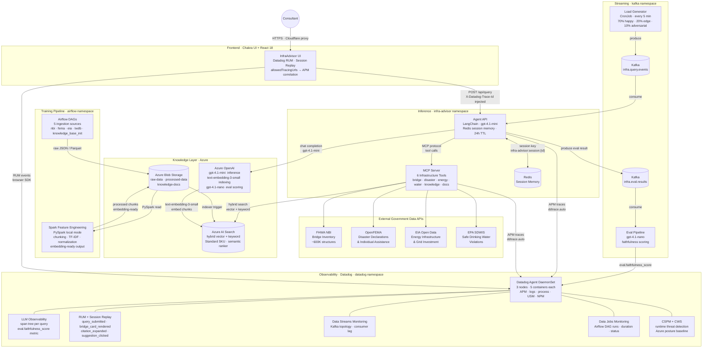

# InfraAdvisor AI

An AI-powered infrastructure advisory platform for consulting firms. Agents answer questions about bridge conditions, disaster history, energy infrastructure, and water systems using live government data sources — deployed on Azure Kubernetes Service with full Datadog observability.

Built as a reference architecture for **building, training, deploying, and monitoring an AI agent** end-to-end, using [Model Context Protocol (MCP)](https://modelcontextprotocol.io), [LangChain](https://python.langchain.com), [Azure OpenAI](https://azure.microsoft.com/en-us/products/ai-services/openai-service), [Apache Spark](https://spark.apache.org), and [Datadog](https://www.datadoghq.com).

---

## System Architecture



---

## Data Flow: From Raw Government Data to Agent Answer

```
1. INGEST   Airflow DAGs pull raw data from FHWA NBI / OpenFEMA / EIA / EPA / TWDB
               └─► write JSON + Parquet to Azure Blob Storage  (raw-data/)

2. PROCESS  Spark Feature Engineering DAG (PySpark local mode)
               reads raw-data/ → normalize · chunk · TF-IDF features
               └─► writes embedding-ready chunks to Azure Blob Storage  (processed-data/)

3. INDEX    Azure AI Search indexer picks up processed-data/
               text-embedding-3-small computes dense vectors
               └─► hybrid index ready (vector + BM25 keyword)

4. QUERY    Consultant submits question via React UI
               Agent API (LangChain) → selects MCP tool → calls AI Search (hybrid)
               └─► top-k chunks retrieved, LLM synthesises answer with citations

5. EVAL     Kafka consumer scores faithfulness async (gpt-4.1-nano)
               └─► eval.faithfulness_score metric sent to Datadog
```

---

## Services

| Service | Language | Description |
|---|---|---|
| [`services/mcp-server`](services/mcp-server/) | Python 3.12 | FastMCP server — 6 infrastructure tools |
| [`services/agent-api`](services/agent-api/) | Python 3.12 | FastAPI + LangChain agent, Redis session memory, Kafka eval |
| [`services/load-generator`](services/load-generator/) | Python 3.12 | Kafka producer — 3-tier synthetic query corpus |
| [`services/ui`](services/ui/) | TypeScript / React 18 / Chakra UI | Chat interface with bridge cards, citation panel, RUM |
| [`services/ingestion`](services/ingestion/) | Python 3.12 | 6 Airflow DAGs — 5 data sources + Spark feature engineering |

## Infrastructure

| Component | Technology | Namespace |
|---|---|---|
| Container platform | AKS — 3× Standard_D2s_v3 | — |
| AI inference | Azure OpenAI (gpt-4.1-mini, text-embedding-3-small, gpt-4.1-nano) | — |
| Knowledge base | Azure AI Search Standard — hybrid + semantic | — |
| Blob storage | Azure Blob Storage — raw-data, processed-data, knowledge-docs | — |
| Session memory | Redis deployment | `infra-advisor` |
| Message bus | Kafka via Strimzi | `kafka` |
| Ingestion orchestration | Apache Airflow 3.x (LocalExecutor) | `airflow` |
| Feature engineering | Apache Spark PySpark (local mode via Airflow) | `airflow` |
| Observability | Datadog Operator — Agent DaemonSet + Cluster Agent | `datadog` |
| IaC | Azure Bicep — subscription-scoped | — |

---

## Prerequisites

- **Azure**: subscription with Contributor access
- **Azure CLI** (`az`), **kubectl**, **kubelogin**, **Helm 3**
- **Python 3.12** + [uv](https://docs.astral.sh/uv/)
- **Docker** (or Podman) for local builds
- **Datadog account** (US3 site) with API + App keys
- **EIA API key** (free at [eia.gov](https://www.eia.gov/opendata/))

## Quick Start

### 1. Configure environment

```bash
cp .env.example .env
# Fill in all values — see .env.example for required keys
```

### 2. Deploy Azure infrastructure

```bash
make deploy-infra        # AKS, Azure OpenAI, AI Search, Blob Storage via Bicep
make get-credentials     # fetches kubeconfig
kubelogin convert-kubeconfig -l azurecli
```

### 3. Create Kubernetes secrets

```bash
# Datadog Agent secret
kubectl create secret generic datadog-secret -n datadog \
  --from-literal=api-key="$(grep ^DD_API_KEY= .env | cut -d= -f2-)" \
  --from-literal=app-key="$(grep ^DD_APP_KEY= .env | cut -d= -f2-)"

# App service secrets (agent-api, mcp-server)
kubectl create secret generic mcp-server-secret -n infra-advisor \
  --from-literal=AZURE_OPENAI_ENDPOINT="$(grep ^AZURE_OPENAI_ENDPOINT= .env | cut -d= -f2-)" \
  --from-literal=AZURE_OPENAI_API_KEY="$(grep ^AZURE_OPENAI_API_KEY= .env | cut -d= -f2-)" \
  --from-literal=AZURE_SEARCH_ENDPOINT="$(grep ^AZURE_SEARCH_ENDPOINT= .env | cut -d= -f2-)" \
  --from-literal=AZURE_SEARCH_API_KEY="$(grep ^AZURE_SEARCH_API_KEY= .env | cut -d= -f2-)" \
  --from-literal=DD_API_KEY="$(grep ^DD_API_KEY= .env | cut -d= -f2-)"

make create-ghcr-secret   # GHCR imagePullSecret
make create-airflow-secret  # airflow-azure-secret
```

### 4. Deploy to Kubernetes

```bash
make deploy-k8s          # applies all K8s manifests (skips k8s/datadog/ — managed by Operator)
make run-dags            # triggers all 6 Airflow DAGs including Spark feature engineering
```

### 5. Access the UI

App is served at `https://infra-advisor-ai.kyletaylor.dev` via Cloudflare → AKS LoadBalancer.

```bash
# Local development
kubectl port-forward -n infra-advisor svc/ui 3000:80
# Open http://localhost:3000
```

---

## Local Development

```bash
# Run service tests
uv run pytest -x services/mcp-server/tests/
uv run pytest -x services/agent-api/tests/
uv run pytest -x services/load-generator/tests/

# Run UI dev server
cd services/ui && npm install && npm run dev
```

## CI/CD

| Workflow | Trigger | Description |
|---|---|---|
| [CI](.github/workflows/ci.yml) | push / PR | pytest for all Python services |
| [Build & Push](.github/workflows/build-push.yml) | push to main | Docker build + push to GHCR (passes `VITE_DD_RUM_*` as build args) |

Images: `ghcr.io/kyletaylored/infra-advisor-ai/{service}:latest`

## Documentation

- [Project Map](docs/agent-guides/project-map.md) — services, namespaces, APIs
- [Build, Test & Verify](docs/agent-guides/build-test-verify.md) — per-phase commands
- [Core Conventions](docs/agent-guides/core-conventions.md) — coding standards
- [Resource Group Migration](docs/resource-group-migration.md) — AKS 2-RG architecture explained

## Key Design Decisions

| Decision | Rationale |
|---|---|
| MCP for tool abstraction | Agent never calls government APIs directly — all data access through versioned MCP tools |
| No LLM in MCP server | `draft_document` uses Jinja2 only; LLM reasoning stays in the agent layer |
| Spark for feature engineering | PySpark runs in local mode via Airflow — no separate Spark cluster needed for demo scale; upgrade path to Spark on K8s is straightforward |
| Azure Blob as pipeline staging | Raw → processed handoff between Airflow DAGs and AI Search indexer; Datadog Storage Monitoring tracks blob-level read/write ops |
| Kafka for eval pipeline | Load generator → `infra.query.events` → agent → `infra.eval.results`; DSM shows full topology |
| Faithfulness scoring async | `gpt-4.1-nano` scores every response as a fire-and-forget thread — zero added latency for users |
| Datadog Operator (not raw YAML) | Single `DatadogAgent` CR manages DaemonSet, Cluster Agent, RBAC, SSI, and all feature toggles |

## License

MIT
